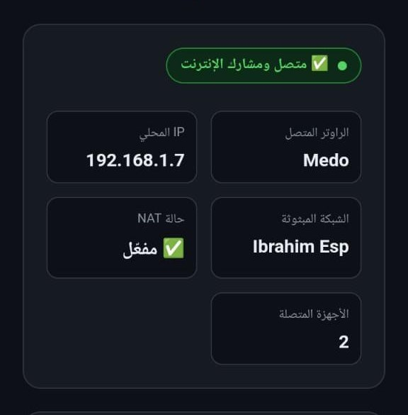

<p align="center">
  
</p>

<p align="center">
  
  
  
  
</p>

<p align="center">
  <b>📡 حول أي شبكة WiFi إلى مكرر (Repeater) مع NAT كامل – لوحة تحكم ويب عربية/إنجليزية</b><br>
  <sub>قم بتوسيع نطاق شبكتك اللاسلكية بسهولة باستخدام ESP32</sub>
</p>

---

## ✨ الميزات السريعة

| الميزة | الوصف |
|--------|-------|
| 🔄 **مكرر WiFi كامل** | يتصل بأي شبكة موجودة ويعيد بثها مع إنترنت كامل |
| 🌐 **NAT مدمج** | مشاركة الإنترنت من الشبكة الأم إلى الشبكة المبثوثة |
| 🎛️ **واجهة ويب احترافية** | لوحة تحكم رسومية لعرض الشبكات وإدارتها |
| 💾 **حفظ الإعدادات** | تخزين بيانات الشبكة في الذاكرة الدائمة |
| 🔁 **إعادة تشغيل تلقائي** | بعد حفظ الإعدادات، يعيد ESP32 التشغيل ليطبقها فوراً |
| 🧹 **إعادة ضبط المصنع** | زر واحد لحذف جميع الإعدادات |
| 🌍 **دعم اللغة العربية** | واجهة ويب كاملة باللغة العربية |

---

## 🖼️ معاينة سريعة للأداة

<p align="center">
  
  
</p>

<p align="center">
  <sub>الشكل 1: واجهة التحكم على 192.168.4.1 – الشكل 2: مخطط الاتصال (راوتر → ESP32 → شبكة Ibrahim Esp)</sub>
</p>

---

## 🚀 روابط سريعة

| الملف | المحتوى |
|-------|----------|
| [📘 التثبيت والإعداد](INSTALL.md) | شرح تثبيت حزمة ESP32 ورفع الكود على اللوحة |
| [🕹️ دليل الاستخدام](USAGE.md) | شرح كيفية استخدام الواجهة وتغيير الشبكات |
| [👤 المطور والرخصة](CREDITS.md) | معلومات المطور والترخيص والمساهمين |

---

## ⚡ تشغيل سريع (للخبراء)

```bash
git clone https://github.com/ibrahimmustafacv/ESP32-NAT-Repeater.git
cd ESP32-NAT-Repeater
# افتح الملف .ino في Arduino IDE → ارفعه على ESP32
# بعد الرفع: اتصل بشبكة "Ibrahim Esp" (48522844) وافتح http://192.168.4.1